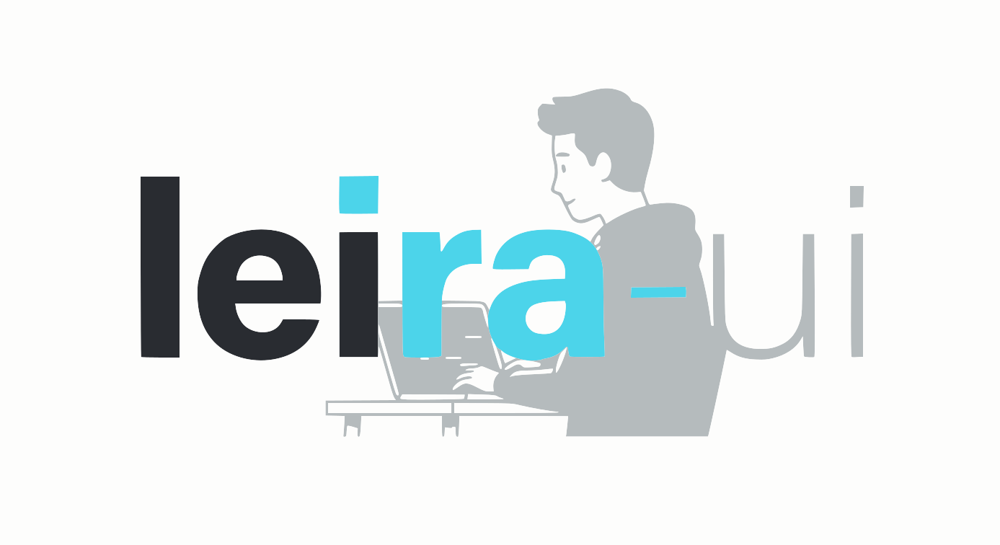

# Leira UI

<p align="center">
  
</p>

<p align="center">
  <strong>Biblioteca de componentes React + Tailwind CSS</strong>
</p>

<p align="center">
  Componentes modernos, elegantes y listos para usar en tus proyectos.
</p>

<p align="center">
  <a href="https://www.npmjs.com/package/leira-ui"></a>
  <a href="https://www.npmjs.com/package/leira-ui"></a>
  
  
  
</p>

---

## 📸 Vista Previa

<p align="center">
  
</p>

---

## ✨ Características

- 🎨 **Tema oscuro premium** por defecto
- ⚡ **React 19** compatible
- 🌊 **Tailwind CSS 4** optimizado  
- 📦 **TypeScript** con tipos incluidos
- 🎭 **Animaciones suaves** y transiciones elegantes
- 📱 **Responsive** y accesible
- 📋 **Copy & Paste** - Copia el código directamente

---

## 📦 Instalación

```bash
npm install leira-ui lucide-react
```

```bash
pnpm add leira-ui lucide-react
```

```bash
yarn add leira-ui lucide-react
```

---

## ⚡ Inicio Rápido

### 1. Importa los estilos en tu archivo principal (main.tsx o App.tsx)

```tsx
import 'leira-ui/styles.css'
```

### 2. Usa los componentes

```tsx
import { Button, Card, CardBody, Input, Alert } from 'leira-ui'

function App() {
  return (
    <Card hover>
      <CardBody>
        <Input label="Email" placeholder="tu@email.com" />
        <Button variant="primary">Enviar</Button>
        <Alert variant="success">¡Operación exitosa!</Alert>
      </CardBody>
    </Card>
  )
}
```

---

## 🧩 Componentes Disponibles

### Formularios
| Componente | Descripción |
|------------|-------------|
| `Button` | Botones con variantes, tamaños y estados de carga |
| `Input` | Campos de entrada con validación e iconos |
| `Textarea` | Área de texto con validación |

### Layout
| Componente | Descripción |
|------------|-------------|
| `Card` | Tarjetas con header, body, footer y hover effects |
| `ImageCard` | Cards con imagen destacada |

### Navegación
| Componente | Descripción |
|------------|-------------|
| `Navbar` | Barra de navegación responsive con dropdowns |
| `Sidebar` | Menú lateral colapsable |
| `DropdownMenu` | Menú desplegable |
| `Breadcrumb` | Navegación de migas de pan |
| `Tabs` | Pestañas con estilos pill y underline |

### Feedback
| Componente | Descripción |
|------------|-------------|
| `Alert` | Alertas de notificación con variantes |
| `Modal` | Modales con animaciones |
| `Tooltip` | Tooltips con posicionamiento flexible |
| `Spinner` | Indicadores de carga |
| `Skeleton` | Placeholders de carga |

### Secciones
| Componente | Descripción |
|------------|-------------|
| `SimpleFooter` | Footer minimalista |
| `MultiColumnFooter` | Footer con múltiples columnas |
| `CenteredFooter` | Footer centrado |
| `NewsletterFooter` | Footer con suscripción |

### Data Display
| Componente | Descripción |
|------------|-------------|
| `Badge` | Etiquetas y badges con estilos |
| `Accordion` | Acordeones colapsables con animaciones |
| `Carousel` | Carrusel básico |
| `ImageCarousel` | Carrusel de imágenes |
| `CardCarousel` | Carrusel de cards |
| `CoverflowCarousel` | Carrusel 3D con perspectiva |
| `TestimonialCarousel` | Carrusel de testimonios |

---

## 📖 Documentación

Visita nuestra documentación completa con ejemplos interactivos:

🔗 **[leira-ui.vercel.app](https://leira-ui.vercel.app)**

---

## 🎨 Personalización

Los componentes usan variables CSS que puedes personalizar:

```css
:root {
  --bg-primary: #0a0a0f;
  --bg-secondary: #12121a;
  --bg-card: #16161f;
  --bg-hover: #1e1e2a;
  --text-primary: #ffffff;
  --text-secondary: #a0a0b0;
  --text-muted: #666680;
  --border-color: #2a2a3a;
}
```

---

## 🛠️ Desarrollo Local

```bash
# Clonar el repositorio
git clone https://github.com/tu-usuario/leira-ui.git
cd leira-ui

# Instalar dependencias
pnpm install

# Iniciar servidor de desarrollo
pnpm dev

# Build paquete NPM
pnpm build:lib
```

---

## 📄 Licencia

MIT © Leira UI

---

<p align="center">
  Hecho con 💜 para la comunidad React
</p>
